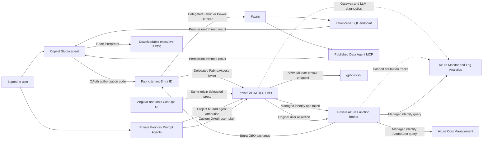
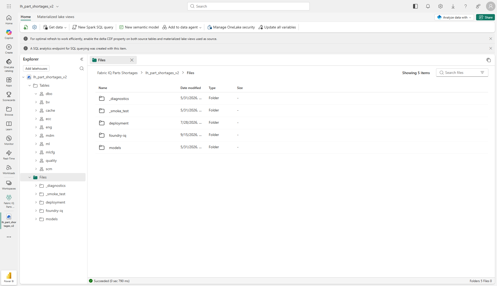
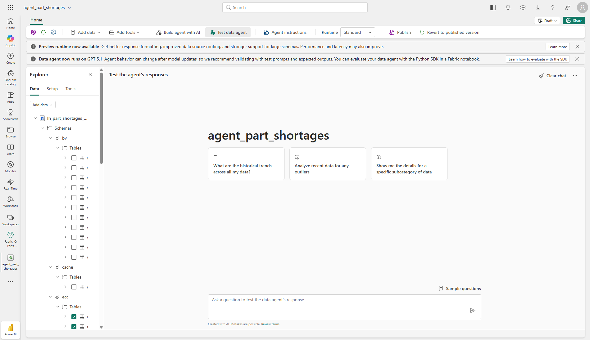
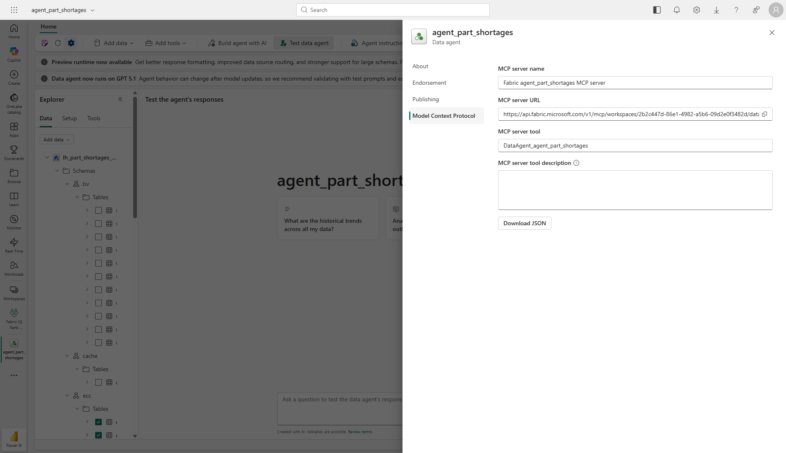

# Microsoft Fabric OBO and AI tokenomics through private API Management

This guide deploys permission-trimmed Microsoft Fabric Lakehouse and Data Agent tools through [Azure API Management (APIM)](https://learn.microsoft.com/azure/api-management/genai-gateway-capabilities). Copilot Studio and Microsoft Foundry agents preserve the signed-in user through OAuth; the broker never falls back to an application identity for Fabric data. A private Foundry project uses `gpt-5.6-sol` only through attributable APIM AI Gateway routes. The responsive Angular/Ionic CostOps UI reconciles APIM token telemetry with Azure Cost Management `ActualCost` without relabeling rate-card estimates as billed cost.

> **Reference status (2026-09-17):** Fabric data and Power BI artifacts are live. The broker, private Foundry foundation, two APIM model routes, OAuth Prompt Agent workflow, Azure-billed cost reconciliation, and production UI host pass local and isolated Azure what-if gates but are not yet deployed. The deployment plan is reopened to `Approved` for formal validation. Immutable agent links are added only after live publication and smoke tests.

## Architecture



The token path is:

1. The user signs in to a Power Platform OAuth custom connector registered in the Fabric resource tenant.
2. The connector sends a delegated v2 token for `api://<resource-api-client-id>/Fabric.Access` to APIM.
3. APIM validates tenant, audience, scope, connector client ID, user object ID, and token type.
4. APIM acquires an application token for the broker with its system-assigned managed identity and forwards the original user assertion separately.
5. The broker independently validates both tokens, then performs Microsoft Entra OBO for the fixed downstream scope.
6. Fabric applies the user's workspace, item, table, row-level, and column-level permissions.

This delegation follows the [Microsoft identity platform OBO flow](https://learn.microsoft.com/entra/identity-platform/v2-oauth2-on-behalf-of-flow). APIM performs gateway-side JWT validation with [`validate-jwt`](https://learn.microsoft.com/azure/api-management/validate-jwt-policy), obtains the broker token with [`authentication-managed-identity`](https://learn.microsoft.com/azure/api-management/authentication-managed-identity-policy), and enforces per-user throttling with [`rate-limit-by-key`](https://learn.microsoft.com/azure/api-management/rate-limit-by-key-policy).

## Contents

- [Completion prompts and remaining TODOs](docs/prompts.md)
- [Direct URLs and portals](#direct-urls-and-portals)
- [Live Caldova workspace and Power BI](#live-caldova-workspace-and-power-bi)
- [Reference Fabric screenshots](#reference-fabric-screenshots)
- [Security boundaries](#security-boundaries)
- [Prerequisites](#prerequisites)
- [Configuration](#configuration)
- [Deployment paths](#deployment-paths)
- [Identity and consent](#identity-and-consent)
- [APIM APIs and MCP](#apim-apis-and-mcp)
- [Tokenomics and responsive UI](#tokenomics-and-responsive-ui)
- [Copilot Studio agents](#copilot-studio-agents)
- [Microsoft Foundry agents](#microsoft-foundry-agents)
- [Validation and acceptance](#validation-and-acceptance)
- [Screenshot evidence checklist](#screenshot-evidence-checklist)
- [Rollback](#rollback)
- [References](#references)

## Direct URLs and portals

The status column is intentional. **Live** links identify deployed artifacts. **Local** links work on this machine while the development server is running. **Post-deploy** URLs are deterministic private endpoints from [config/deployment.json](config/deployment.json), but they must not be treated as available until deployment and acceptance pass. The private APIM and Function URLs require an authorized network path and valid Microsoft Entra token.

| Surface | Direct URL | Status |
| --- | --- | --- |
| CostOps tokenomics UI | [http://localhost:4200/](http://localhost:4200/) | Local development |
| UI production URL | [https://caldova-fabric-costops-ui.azurewebsites.net](https://caldova-fabric-costops-ui.azurewebsites.net) | Post-deploy; public host, authenticated data |
| APIM service in Azure portal | [caldova-apim-westus overview](https://portal.azure.com/#@12a4b86b-e64c-43f9-af05-d9130a72dfd2/resource/subscriptions/cf824570-a8ba-497a-a184-0a52f1830aa9/resourceGroups/m365-myaacoub/providers/Microsoft.ApiManagement/service/caldova-apim-westus/overview) | Live shared service |
| APIM `fabric` product | [fabric product](https://portal.azure.com/#@12a4b86b-e64c-43f9-af05-d9130a72dfd2/resource/subscriptions/cf824570-a8ba-497a-a184-0a52f1830aa9/resourceGroups/m365-myaacoub/providers/Microsoft.ApiManagement/service/caldova-apim-westus/products/fabric) | Post-deploy; published |
| APIM `foundry` product | [foundry product](https://portal.azure.com/#@12a4b86b-e64c-43f9-af05-d9130a72dfd2/resource/subscriptions/cf824570-a8ba-497a-a184-0a52f1830aa9/resourceGroups/m365-myaacoub/providers/Microsoft.ApiManagement/service/caldova-apim-westus/products/foundry) | Post-deploy; published |
| APIM private gateway | [https://caldova-apim-westus.azure-api.net](https://caldova-apim-westus.azure-api.net) | Live gateway; private access |
| Lakehouse table discovery | [https://caldova-apim-westus.azure-api.net/fabric-lakehouse/tables](https://caldova-apim-westus.azure-api.net/fabric-lakehouse/tables) | Post-deploy |
| Lakehouse read-only query | [https://caldova-apim-westus.azure-api.net/fabric-lakehouse/query](https://caldova-apim-westus.azure-api.net/fabric-lakehouse/query) | Post-deploy |
| Lakehouse MCP | [https://caldova-apim-westus.azure-api.net/fabric-lakehouse-mcp/mcp](https://caldova-apim-westus.azure-api.net/fabric-lakehouse-mcp/mcp) | Post-deploy |
| Data Agent query | [https://caldova-apim-westus.azure-api.net/fabric-data-agent/query](https://caldova-apim-westus.azure-api.net/fabric-data-agent/query) | Post-deploy |
| Data Agent MCP | [https://caldova-apim-westus.azure-api.net/fabric-data-agent-mcp/mcp](https://caldova-apim-westus.azure-api.net/fabric-data-agent-mcp/mcp) | Post-deploy |
| Tokenomics summary API | [https://caldova-apim-westus.azure-api.net/fabric-tokenomics/summary](https://caldova-apim-westus.azure-api.net/fabric-tokenomics/summary) | Post-deploy |
| Lakehouse model gateway | [https://caldova-apim-westus.azure-api.net/fabric-foundry-inference/lakehouse](https://caldova-apim-westus.azure-api.net/fabric-foundry-inference/lakehouse) | Post-deploy; project managed identity only |
| Data Agent model gateway | [https://caldova-apim-westus.azure-api.net/fabric-foundry-inference/data-agent](https://caldova-apim-westus.azure-api.net/fabric-foundry-inference/data-agent) | Post-deploy; project managed identity only |
| Private Foundry account | [foundry-fabric-costops overview](https://portal.azure.com/#@12a4b86b-e64c-43f9-af05-d9130a72dfd2/resource/subscriptions/cf824570-a8ba-497a-a184-0a52f1830aa9/resourceGroups/m365-myaacoub/providers/Microsoft.CognitiveServices/accounts/foundry-fabric-costops/overview) | Post-deploy |
| Foundry project endpoint | [https://foundry-fabric-costops.services.ai.azure.com/api/projects/fabric-costops](https://foundry-fabric-costops.services.ai.azure.com/api/projects/fabric-costops) | Post-deploy; private access |
| Broker Function in Azure portal | [caldova-fabric-obo-fn overview](https://portal.azure.com/#@12a4b86b-e64c-43f9-af05-d9130a72dfd2/resource/subscriptions/cf824570-a8ba-497a-a184-0a52f1830aa9/resourceGroups/m365-myaacoub/providers/Microsoft.Web/sites/caldova-fabric-obo-fn/overview) | Post-deploy |
| Broker private health endpoint | [https://caldova-fabric-obo-fn.azurewebsites.net/api/health](https://caldova-fabric-obo-fn.azurewebsites.net/api/health) | Post-deploy; private access |
| Native Fabric Data Agent MCP | [https://api.fabric.microsoft.com/v1/mcp/workspaces/53829079-597d-4c27-9897-6a2042473761/dataagents/25696ea2-a91e-4b18-9846-5d045c6a082e/agent](https://api.fabric.microsoft.com/v1/mcp/workspaces/53829079-597d-4c27-9897-6a2042473761/dataagents/25696ea2-a91e-4b18-9846-5d045c6a082e/agent) | Live; Fabric bearer token required |
| Power Platform environment | [Caldova Private in Power Apps](https://make.powerapps.com/environments/52456fcd-1d20-ecdb-aa2e-8979e3f794f5/home) | Live environment |
| Copilot Studio environment | [Caldova Private in Copilot Studio](https://copilotstudio.microsoft.com/environments/52456fcd-1d20-ecdb-aa2e-8979e3f794f5/home) | Live environment |

Live agent deep links require immutable version IDs. Add the Copilot Studio bot IDs and Foundry Prompt Agent versions here only after publication and a successful live readback. Until then, use the deterministic project endpoint and source links below.

## Live Caldova workspace and Power BI

These links point to the deployed Caldova tenant artifacts and require an authorized Caldova account.

| Artifact | Link |
| --- | --- |
| Fabric workspace | [Fabric IQ Parts Shortages](https://app.fabric.microsoft.com/groups/53829079-597d-4c27-9897-6a2042473761?ctid=12a4b86b-e64c-43f9-af05-d9130a72dfd2) |
| Lakehouse | [lh_part_shortages_v2](https://app.fabric.microsoft.com/groups/53829079-597d-4c27-9897-6a2042473761/lakehouses/a757a457-6402-4c2a-bf5e-1f80d55f68e8?ctid=12a4b86b-e64c-43f9-af05-d9130a72dfd2) |
| Fabric Data Agent | [agent_part_shortages](https://app.fabric.microsoft.com/groups/53829079-597d-4c27-9897-6a2042473761/aiskills/25696ea2-a91e-4b18-9846-5d045c6a082e?ctid=12a4b86b-e64c-43f9-af05-d9130a72dfd2) |
| Power BI semantic model | [sm_part_shortages](https://app.powerbi.com/groups/53829079-597d-4c27-9897-6a2042473761/datasets/18be2ce1-3566-437d-971d-c4532e2e3575?ctid=12a4b86b-e64c-43f9-af05-d9130a72dfd2) |
| Power BI report | [Fabric Parts Shortages Executive Analytics](https://app.powerbi.com/groups/53829079-597d-4c27-9897-6a2042473761/reports/33c7ffc1-69d9-4a9c-a6a7-fdb9417c29f9?ctid=12a4b86b-e64c-43f9-af05-d9130a72dfd2) |
| Power BI report | [shortages-executive-report](https://app.powerbi.com/groups/53829079-597d-4c27-9897-6a2042473761/reports/b061fa31-6ed0-4415-80f8-9e58fba07d26?ctid=12a4b86b-e64c-43f9-af05-d9130a72dfd2) |
| Power BI report | [spm-feedback-and-resolution-report](https://app.powerbi.com/groups/53829079-597d-4c27-9897-6a2042473761/reports/8c02521b-b2c3-4309-83c2-6ce4391c5b1a?ctid=12a4b86b-e64c-43f9-af05-d9130a72dfd2) |
| Power BI dashboard | [Fabric Parts Shortages Executive Dashboard](https://app.powerbi.com/groups/53829079-597d-4c27-9897-6a2042473761/dashboards/871a0eea-fd2b-40d0-bb94-34c031975f03?ctid=12a4b86b-e64c-43f9-af05-d9130a72dfd2) |
| Power BI dashboard | [Fabric Supply Risk Dashboard](https://app.powerbi.com/groups/53829079-597d-4c27-9897-6a2042473761/dashboards/e32f630f-3ea1-41d9-8943-3c319051159f?ctid=12a4b86b-e64c-43f9-af05-d9130a72dfd2) |

## Reference Fabric screenshots

These images are actual reference-tenant views captured on 2026-09-16. They contain no token, password, client secret, APIM subscription key, or query result.

### Lakehouse and SQL analytics endpoint

**Browser URL:** <https://app.powerbi.com/groups/2b2c447d-86e1-4982-a5b6-09d2e0f3482d/lakehouses/d487748c-006e-4945-a2ac-9ddb26c999f1?ctid=b158173c-91f6-4f99-b5e9-aa9bcb463863&experience=power-bi&selectedPath=Files>

The Lakehouse view confirms the configured `lh_part_shortages_v2` item, its schema-enabled tables, files, and SQL analytics endpoint.



### Fabric Data Agent

**Browser URL:** <https://app.fabric.microsoft.com/groups/2b2c447d-86e1-4982-a5b6-09d2e0f3482d/aiskills/2ec6cb5e-2f5c-44e7-9c0d-a113cb372741?ctid=b158173c-91f6-4f99-b5e9-aa9bcb463863>

The Data Agent view confirms `agent_part_shortages`, its bound Lakehouse, selected schemas, test surface, and publish controls.



### Published Data Agent MCP endpoint

**Browser URL:** <https://app.fabric.microsoft.com/groups/2b2c447d-86e1-4982-a5b6-09d2e0f3482d/aiskills/2ec6cb5e-2f5c-44e7-9c0d-a113cb372741?ctid=b158173c-91f6-4f99-b5e9-aa9bcb463863>

Navigation: **Data Agent > Settings > Model Context Protocol**.

The MCP view confirms the server name, published endpoint, and single tool identifier. The endpoint is configuration, not a credential; every request still requires a valid Fabric bearer token.



## Security boundaries

- The broker accepts calls only from the configured APIM system-assigned identity and requires the `Fabric.Broker.Invoke` application role.
- User assertions must be v2 delegated tokens from the Fabric resource tenant with `Fabric.Access`, an approved connector `azp`, and an explicitly allowed user `oid`.
- OBO requests use only `https://api.fabric.microsoft.com/.default` or `https://analysis.windows.net/powerbi/api/.default`.
- The resource app requests only `DataAgent.Execute.All`, `Lakehouse.Read.All`, and `SQLEndpoint.Read.All` delegated permissions.
- Lakehouse SQL accepts one read-only `SELECT` or CTE, rejects multiple statements and write primitives, and caps input length and returned rows.
- Tokens and bodies are not logged. Responses are marked `no-store`.
- The OBO client secret is written through the write-only Key Vault ARM child resource while the vault remains private; it never enters source, generated metadata, command output, Terraform state, or screenshots.
- Connector credentials are generated in memory and sent directly to Power Platform.

The connector design follows [Copilot Studio OBO authentication for custom connectors](https://learn.microsoft.com/microsoft-copilot-studio/advanced-custom-connector-on-behalf-of), and Foundry connections must use [OAuth identity passthrough for MCP authentication](https://learn.microsoft.com/azure/foundry/agents/how-to/mcp-authentication). Neither path may substitute a shared application identity for the signed-in user.

## Prerequisites

Use accounts with the following narrowly scoped privileges:

- Fabric workspace and item read/admin rights needed to inspect the Lakehouse, Data Agent, and user grants.
- Azure rights to validate deployments, create resources, peer the configured VNets, and assign the template's scoped roles.
- Microsoft Entra rights to manage app registrations, service principals, delegated consent, and the APIM managed-identity app-role assignment.
- Power Platform environment administration in a Managed Environment with Dataverse.
- Copilot Studio authoring, solution import, code interpreter, and publish privileges.

The configured Power Platform environment must be resolved by ID before connector or agent mutation. Do not create a replacement environment automatically.

### Workspace Private Link gate

Microsoft Fabric workspace-level Private Link is intentionally disabled in [config/deployment.json](config/deployment.json). This workspace contains Power BI semantic models, which are incompatible with that workspace restriction. Do not enable inbound restriction or delete/move those items automatically. The customer-owned APIM and broker VNets can still be peered; Fabric remains a multitenant downstream service reached with delegated HTTPS tokens.

## Configuration

All nonsecret customer inputs live in [config/deployment.json](config/deployment.json). Bicep reads that file where supported; PowerShell maps it to required parameters; Terraform exposes equivalent variables and example tfvars.

Before deployment, replace or resolve:

- tenant, subscription, resource group, location, and existing resource IDs;
- Fabric workspace, Lakehouse, SQL endpoint, and Data Agent IDs;
- APIM service, gateway, API paths, product, and VNet;
- dedicated Foundry account/project, exclusive agent subnet, pinned model, and per-agent connections;
- existing Windows App Service plan, broker/UI integration subnet, and production UI URL;
- resource-group `ActualCost` scope, billing lag, and tracked resources;
- Power Platform environment ID;
- allowed Fabric-tenant user object IDs.

Never add credentials to this file.

## Deployment paths

Bicep is the live reference deployment path. Terraform is an equivalent customer option; do not let both tools manage the same deployed resources.

### Bicep

Deploy in this order:

1. Deploy [bicep/broker/main.bicep](bicep/broker/main.bicep) with `deployFunction=false`.
2. Deploy the private Foundry foundation in [bicep/foundry/main.bicep](bicep/foundry/main.bicep).
3. Run [scripts/provision-identity.ps1](scripts/provision-identity.ps1); credentials go directly to Key Vault or their platform connection store.
4. Build/upload the Function package and redeploy the broker with generated IDs and `deployFunction=true`.
5. Deploy the REST, MCP, tokenomics, and two model APIs from [bicep/apim/main.bicep](bicep/apim/main.bicep).
6. Deploy the production Web App from [bicep/ui/main.bicep](bicep/ui/main.bicep), then publish [the portable UI package](scripts/build-ui-package.ps1).
7. Deploy the two model connections from [bicep/foundry/connections.bicep](bicep/foundry/connections.bicep).
8. Run [scripts/provision-foundry-agents.ps1](scripts/provision-foundry-agents.ps1) to create OAuth connections, register redirects, version both Prompt Agents, and smoke-test model traffic.
9. Run [scripts/create-connectors.ps1](scripts/create-connectors.ps1), then package, bind, test, and publish Copilot Studio agents.

[scripts/deploy.ps1](scripts/deploy.ps1) implements this order through `broker-base`, `foundry-base`, `identity`, `package`, `broker-app`, `apim`, `ui`, `foundry-connections`, and `foundry-agents` stages.

Run incremental deployments only. Review every `what-if` result and stop on an unexpected delete, replacement, VNet change, APIM service change, or App Service plan change.

### Terraform

Equivalent independent modules are under [terraform](terraform):

- `network-apim-side`
- `network-broker-side`
- `broker`
- `apim`
- `foundry`
- `ui`

Run `terraform fmt -check`, `terraform init -backend=false`, and `terraform validate` before configuring a real backend. Keep state in customer-controlled remote storage; never commit state or tfvars.

## Identity and consent

[scripts/provision-identity.ps1](scripts/provision-identity.ps1) idempotently creates or reconciles:

- a Fabric-tenant resource API with delegated `Fabric.Access`;
- separate Lakehouse and Data Agent OAuth connector clients;
- separate Lakehouse and Data Agent custom OAuth clients for Foundry MCP connections;
- least-privilege downstream Fabric delegated permissions;
- principal-scoped consent for explicitly allowed users;
- a caller-tenant broker API with `Fabric.Broker.Invoke`;
- the APIM managed-identity role assignment.

A Caldova user must exist as a redeemed guest in the Fabric resource tenant before it can receive principal-scoped consent or pass the broker allowlist. Do not replace that requirement with tenant-wide consent.

The script writes only nonsecret IDs to the ignored `.generated` directory. With `-KeyVaultName`, a new resource-API credential goes directly from Microsoft Graph to the write-only Key Vault ARM secret resource and is cleared from process variables. It never enables public vault access.

## APIM APIs and MCP

APIM deploys three REST APIs, two MCP projections, and two model-inference APIs. They are grouped into two published, subscription-free products because authentication is enforced by delegated OAuth or project managed identity rather than APIM subscription keys.

| APIM product | Included APIs |
| --- | --- |
| `fabric` | Fabric Lakehouse REST, Fabric Data Agent REST, Fabric Lakehouse MCP, Fabric Data Agent MCP, and Fabric Tokenomics |
| `foundry` | Lakehouse Prompt Agent inference and Data Agent Prompt Agent inference |

The products are deliberately separate: Fabric data/tool traffic remains visible as `fabric`, while all model traffic is governed and metered under `foundry`. APIM's ability to govern APIs, models, and MCP servers is described in the [AI gateway capabilities reference](https://learn.microsoft.com/azure/api-management/genai-gateway-capabilities).

| Surface | Path | Full private gateway URL | Purpose |
| --- | --- | --- | --- |
| Lakehouse REST | `/fabric-lakehouse` | [https://caldova-apim-westus.azure-api.net/fabric-lakehouse](https://caldova-apim-westus.azure-api.net/fabric-lakehouse) | List visible tables and run one read-only query |
| Lakehouse MCP | `/fabric-lakehouse-mcp/mcp` | [https://caldova-apim-westus.azure-api.net/fabric-lakehouse-mcp/mcp](https://caldova-apim-westus.azure-api.net/fabric-lakehouse-mcp/mcp) | MCP projection of the governed REST operations |
| Data Agent REST | `/fabric-data-agent` | [https://caldova-apim-westus.azure-api.net/fabric-data-agent](https://caldova-apim-westus.azure-api.net/fabric-data-agent) | Proxy one natural-language Data Agent request |
| Data Agent MCP | `/fabric-data-agent-mcp/mcp` | [https://caldova-apim-westus.azure-api.net/fabric-data-agent-mcp/mcp](https://caldova-apim-westus.azure-api.net/fabric-data-agent-mcp/mcp) | MCP projection of the governed REST operation |
| Tokenomics REST | `/fabric-tokenomics/summary` | [https://caldova-apim-westus.azure-api.net/fabric-tokenomics/summary](https://caldova-apim-westus.azure-api.net/fabric-tokenomics/summary) | Return a fixed, privacy-preserving usage and cost summary; never accepts caller-supplied KQL |
| Lakehouse inference | `/fabric-foundry-inference/lakehouse` | [https://caldova-apim-westus.azure-api.net/fabric-foundry-inference/lakehouse](https://caldova-apim-westus.azure-api.net/fabric-foundry-inference/lakehouse) | Validate the project identity, enforce Lakehouse agent attribution/TPM, and call the private model with APIM managed identity |
| Data Agent inference | `/fabric-foundry-inference/data-agent` | [https://caldova-apim-westus.azure-api.net/fabric-foundry-inference/data-agent](https://caldova-apim-westus.azure-api.net/fabric-foundry-inference/data-agent) | Validate the project identity, enforce Data Agent attribution/TPM, and call the private model with APIM managed identity |

Copilot Studio uses OAuth custom connectors for the private APIM path, following Microsoft's guidance for [using Power Platform connectors as agent tools](https://learn.microsoft.com/microsoft-copilot-studio/advanced-connectors). Direct Copilot Studio MCP authoring is not assumed to have Power Platform VNet injection. The connector definitions use Swagger 2.0, typed request bodies, and generated redirect URIs.

## Tokenomics and responsive UI

The tokenomics design adapts the attribution pattern in the [Azure-Samples APIM Costing & Showback accelerator](https://github.com/Azure-Samples/Apim-Samples/blob/main/samples/costing/README.md). APIM exports resource-specific `ApiManagementGatewayLogs` and `ApiManagementGatewayLlmLog` records to the broker's dedicated Log Analytics workspace. The broker joins token rows to allowlisted gateway correlations, combines them with privacy-safe hashed user/application/business dimensions, and exposes only fixed 1, 7, 30, or 90-day summaries. Microsoft documents the source tables and token caveats in [Set Up Logging for Language Model APIs](https://learn.microsoft.com/azure/api-management/api-management-howto-llm-logs).

High-cardinality request/user detail stays in logs and traces. Bounded dimensions can use APIM's [`llm-emit-token-metric` policy](https://learn.microsoft.com/azure/api-management/llm-emit-token-metric-policy), which documents the five-custom-dimension and active-time-series limits. The broker queries Azure Monitor with its managed identity and workspace-scoped Log Analytics Reader role, following the [Azure Monitor Logs Query API](https://learn.microsoft.com/azure/azure-monitor/logs/api/overview).

Cost remains separate from usage. The broker queries the [Cost Management Query API](https://learn.microsoft.com/rest/api/cost-management/query/usage) with `type=ActualCost` at only the configured resource-group scope. It reports billing source, status, bill-through date, expected lag, dedicated model cost, shared platform cost, and untracked scope cost. Dedicated model cost is allocated to agents by observed APIM token share and labeled with that method. Market and negotiated rate-card values remain estimates; an empty rate card never suppresses billed cost or invents savings.

The [UI source](ui) uses [Angular](https://github.com/angular/angular), [Ionic](https://github.com/ionic-team/ionic-framework), [MSAL.js](https://github.com/AzureAD/microsoft-authentication-library-for-js), and [Chart.js](https://github.com/chartjs/Chart.js). It provides a desktop sidebar and dense five-KPI view, a tablet icon rail and two-column analytics view, and phone bottom tabs with single-view navigation. No demo dataset is checked in. The placeholder runtime config renders a configuration-required state; a live build injects only public tenant/client/scope/API values from generated identity metadata.

```powershell
# Build with the generated public SPA identity after identity provisioning.
pwsh scripts/build-ui.ps1
npm start --prefix ui -- --host 127.0.0.1 --port 4200
```

Open [http://localhost:4200/](http://localhost:4200/) for the local UI. No production UI host is currently configured, so the README intentionally does not claim a public UI URL.
The production host is [https://caldova-fabric-costops-ui.azurewebsites.net](https://caldova-fabric-costops-ui.azurewebsites.net). It serves compiled assets from the existing Windows B1 plan and proxies only `/api/fabric-tokenomics/summary` over the existing VNet peering/private DNS path. The browser still obtains and sends the delegated token; the host stores no credential and the shared APIM remains private.

## Copilot Studio agents

Source-controlled CLI-authored agent workspaces are under [agents](agents):

- [Lakehouse agent source](agents/lakehouse): `Fabric Parts Shortages Analyst`, using only the Lakehouse connector.
- [Data Agent source](agents/data-agent): `Fabric Data Agent Analyst`, using only the Data Agent connector.

Author and publish them in the [Caldova Private Copilot Studio environment](https://copilotstudio.microsoft.com/environments/52456fcd-1d20-ecdb-aa2e-8979e3f794f5/home). Their direct bot URLs are pending publication because the repository does not yet contain verified live bot IDs.

Both define the generalized [executive-deck-builder skill](skills/executive-deck-builder/SKILL.md) and the instructions that must govern the live code-interpreter prompt. Presentation requests must gather at least three complementary permission-trimmed result sets and then generate a real downloadable `.pptx`. Every number must trace to a Fabric result.

`package-agents.ps1` creates two Dataverse solution ZIPs locally and reports non-authoritative package evidence such as component-entry count and expected-name markers. PAC CLI currently packages the local baseline as one agent component; it does not include the loose knowledge file, connector tools, connection references, or code-interpreter prompt. The script performs no cloud mutation: `-Import` and `-Publish` deliberately stop.

Complete agent setup in two phases:

1. Create or import the baseline agents in the resolved environment through an explicitly reviewed Copilot Studio operation.
2. In Copilot Studio, add the correct OAuth custom connector to each agent, create the configured prompt tool with code interpreter enabled, paste the corresponding executive-deck instructions, create a user OAuth connection, and verify both tools.
3. Clone or pull each live agent with PAC CLI so its generated action, prompt, and connection-reference components are captured in the source workspace.
4. Repackage and inspect exact solution relationships and dependencies. The text markers reported by this script are diagnostic only and do not authorize import or publication.
5. Publish in Copilot Studio only after the connector and code-interpreter prompt show **Connected**, exact relationships are reviewed, and the delegated/denied-user tests pass.

## Microsoft Foundry agents

The approved target is the dedicated private `foundry-fabric-costops/fabric-costops` project in West US. It uses the exclusive `foundry-costops-agent` `/24` subnet and a private endpoint in the existing APIM VNet. It does not reuse or modify the unrelated `foundry-myaacoub-private/sales-poc` project or its in-use agent subnet.

Both Prompt Agents use pinned `gpt-5.6-sol` version `2026-07-09` through a distinct `ApiManagement` model connection. APIM validates the project managed identity and fixed agent header, enforces 25K TPM per agent route, emits token metrics, and authenticates to the private model account with its own managed identity. Direct model access is not configured.

| Prompt Agent | Model connection | MCP connection | Allowed tools |
| --- | --- | --- | --- |
| `fabric-lakehouse-costops` | `lakehouse-ai-gateway/gpt-5.6-sol` | `lakehouse-mcp-oauth` | `tables`, `query` |
| `fabric-data-agent-costops` | `data-agent-ai-gateway/gpt-5.6-sol` | `data-agent-mcp-oauth` | `query` |

[scripts/provision-foundry-agents.ps1](scripts/provision-foundry-agents.ps1) creates one custom OAuth client and `RemoteTool` connection per MCP endpoint, requests only `Fabric.Access offline_access`, registers each Foundry-generated redirect URI, and rotates credentials directly into the connection store. It checkpoints every verified connection and agent version so an idempotent rerun can resume after a partial failure without exposing credentials. [The Python helper](scripts/provision-foundry-agents.py) creates idempotent agent versions and runs a model-only gateway smoke test. Full tool acceptance still requires the allowed user to complete the per-connection OAuth consent flow described in [Set up MCP server authentication](https://learn.microsoft.com/azure/foundry/agents/how-to/mcp-authentication).

## Validation and acceptance

Run local validation:

```powershell
pwsh scripts/validate.ps1 -IncludeParity
```

Add `-DeploymentReady` only after the Power Platform environment and user allowlist are resolved.

Live acceptance requires all of the following:

- Azure validation and `what-if` pass for both peerings, both broker stages, and APIM.
- Private Foundry and UI previews are create-only; the exclusive subnet, private endpoint, model, project, and Web App match configuration.
- The existing App Service plan and VNets are referenced, not modified or replaced.
- Public Function and SCM endpoints are denied; APIM resolves the private Function endpoint.
- Anonymous, wrong-tenant, wrong-audience, application-token, unapproved connector, and unapproved user requests fail closed.
- An approved user lists only visible Lakehouse tables and completes a read-only query.
- The Data Agent MCP handshake initializes, lists exactly the expected tool, and returns a permission-trimmed answer.
- The denied-user test returns `403` and no downstream data.
- Azure Cost Management returns `ActualCost`; billing lag and unavailable states remain visible and rate-card estimates are never labeled billed.
- Both Foundry Prompt Agents route model and MCP traffic through their own APIM API IDs and expose only their configured tools.
- Both Copilot Studio agents use user OAuth connections and publish successfully.
- Each agent creates a `.pptx` that contains `ppt/presentation.xml`, native evidence visuals, source notes, and no invented values.

## Screenshot evidence checklist

Capture screenshots only after the corresponding live check passes. Put sanitized PNG files in `docs/images`, add the browser URL above each image, and blur or exclude tokens, secrets, keys, private response rows, and unrelated tenant data.

- [x] Fabric Lakehouse item and schema view.
- [x] Fabric Data Agent and bound data view.
- [x] Fabric Data Agent MCP settings.
- [ ] Resource API overview, Expose an API, v2 token manifest, and least-privilege delegated permissions.
- [ ] Both connector app overviews, generated redirect URIs, and delegated `Fabric.Access` permissions.
- [ ] Broker Function plan, identity, Key Vault reference settings, VNet integration, and sites private endpoint.
- [ ] APIM `fabric` product with the two REST APIs, both MCP APIs, tokenomics, named values, policies, and diagnostics.
- [ ] APIM `foundry` product with both managed-identity inference APIs, token limits, token metrics, and private model backend.
- [ ] Bidirectional APIM/broker VNet peerings and private DNS records.
- [ ] Power Platform environment, enterprise policy, connector General/Security/Definition/Test views.
- [ ] Both Copilot Studio agents with connector tools, OAuth connection, code-interpreter prompt, and published status.
- [ ] Successful delegated Lakehouse/Data Agent tests, denied-user result, and generated deck download.

## Rollback

1. Unpublish or remove the new Copilot Studio agent solutions without changing unrelated agents.
2. Delete the two Foundry Prompt Agent versions and OAuth/model connections, then remove the project capability host before the account.
3. Remove the dedicated Foundry private endpoint/account and wait for its service association to release before deleting the exclusive subnet.
4. Remove the two new custom connectors/connections and revoke their principal-scoped grants and credentials.
5. Remove the additive Fabric, MCP, tokenomics, and inference APIs from APIM.
6. Roll back the Function/UI packages or disable the two apps; remove their dedicated resources only after shared-plan use is checked.
7. Remove the dedicated app registrations only after grants, assignments, redirects, and ownership are recorded.

Do not delete Fabric workspace items, semantic models, the Lakehouse, the Data Agent, the existing APIM service, the existing App Service plan, shared VNets, or unrelated private DNS zones as part of rollback.

## References

Canonical destination URLs are used instead of email Safe Links. Revalidate preview status, API versions, prices, and tenant-specific portal routes before a customer deployment.

### Microsoft Learn

| Topic | Reference |
| --- | --- |
| APIM AI gateway architecture and capabilities | [AI gateway capabilities in Azure API Management](https://learn.microsoft.com/azure/api-management/genai-gateway-capabilities) |
| APIM gateway and LLM token logs | [Set Up Logging for Language Model APIs](https://learn.microsoft.com/azure/api-management/api-management-howto-llm-logs) |
| APIM token metrics and dimension limits | [`llm-emit-token-metric` policy](https://learn.microsoft.com/azure/api-management/llm-emit-token-metric-policy) |
| APIM JWT enforcement | [`validate-jwt` policy](https://learn.microsoft.com/azure/api-management/validate-jwt-policy) |
| APIM managed-identity backend authentication | [`authentication-managed-identity` policy](https://learn.microsoft.com/azure/api-management/authentication-managed-identity-policy) |
| APIM per-key throttling | [`rate-limit-by-key` policy](https://learn.microsoft.com/azure/api-management/rate-limit-by-key-policy) |
| Microsoft Entra delegation | [Microsoft identity platform OAuth 2.0 OBO flow](https://learn.microsoft.com/entra/identity-platform/v2-oauth2-on-behalf-of-flow) |
| Copilot Studio connector OBO | [Configure OBO authentication for custom connectors](https://learn.microsoft.com/microsoft-copilot-studio/advanced-custom-connector-on-behalf-of) |
| Copilot Studio connector tools | [Use Power Platform connectors as agent tools](https://learn.microsoft.com/microsoft-copilot-studio/advanced-connectors) |
| Foundry MCP OAuth identity passthrough | [Set up MCP server authentication](https://learn.microsoft.com/azure/foundry/agents/how-to/mcp-authentication) |
| Foundry tool authentication | [How toolbox authentication works](https://learn.microsoft.com/azure/foundry/agents/how-to/tools/tool-authentication) |
| Foundry private networking | [Set up private networking for Foundry Agent Service](https://learn.microsoft.com/azure/foundry/agents/how-to/virtual-networks) |
| Foundry model connections through APIM | [Bring your own model to Foundry Agent Service](https://learn.microsoft.com/azure/foundry/agents/how-to/ai-gateway) |
| Azure billed cost query | [Cost Management Query API](https://learn.microsoft.com/rest/api/cost-management/query/usage) |
| Programmatic KQL access | [Azure Monitor Logs Query API overview](https://learn.microsoft.com/azure/azure-monitor/logs/api/overview) |
| Public/list price benchmark | [Azure Retail Prices REST API overview](https://learn.microsoft.com/rest/api/cost-management/retail-prices/azure-retail-prices) |
| Negotiated price sheet | [Migrate to the Cost Management Price Sheet API](https://learn.microsoft.com/azure/cost-management-billing/automate/migrate-ea-price-sheet-api) |

### GitHub and open-source implementations

| Project | Reference |
| --- | --- |
| APIM costing accelerator supplied with this implementation request | [Azure-Samples/Apim-Samples: Costing & Showback](https://github.com/Azure-Samples/Apim-Samples/blob/main/samples/costing/README.md) |
| Angular application framework | [angular/angular](https://github.com/angular/angular) |
| Ionic responsive component framework | [ionic-team/ionic-framework](https://github.com/ionic-team/ionic-framework) |
| Microsoft Authentication Library for browser and Node.js | [AzureAD/microsoft-authentication-library-for-js](https://github.com/AzureAD/microsoft-authentication-library-for-js) |
| Canvas charting | [chartjs/Chart.js](https://github.com/chartjs/Chart.js) |
